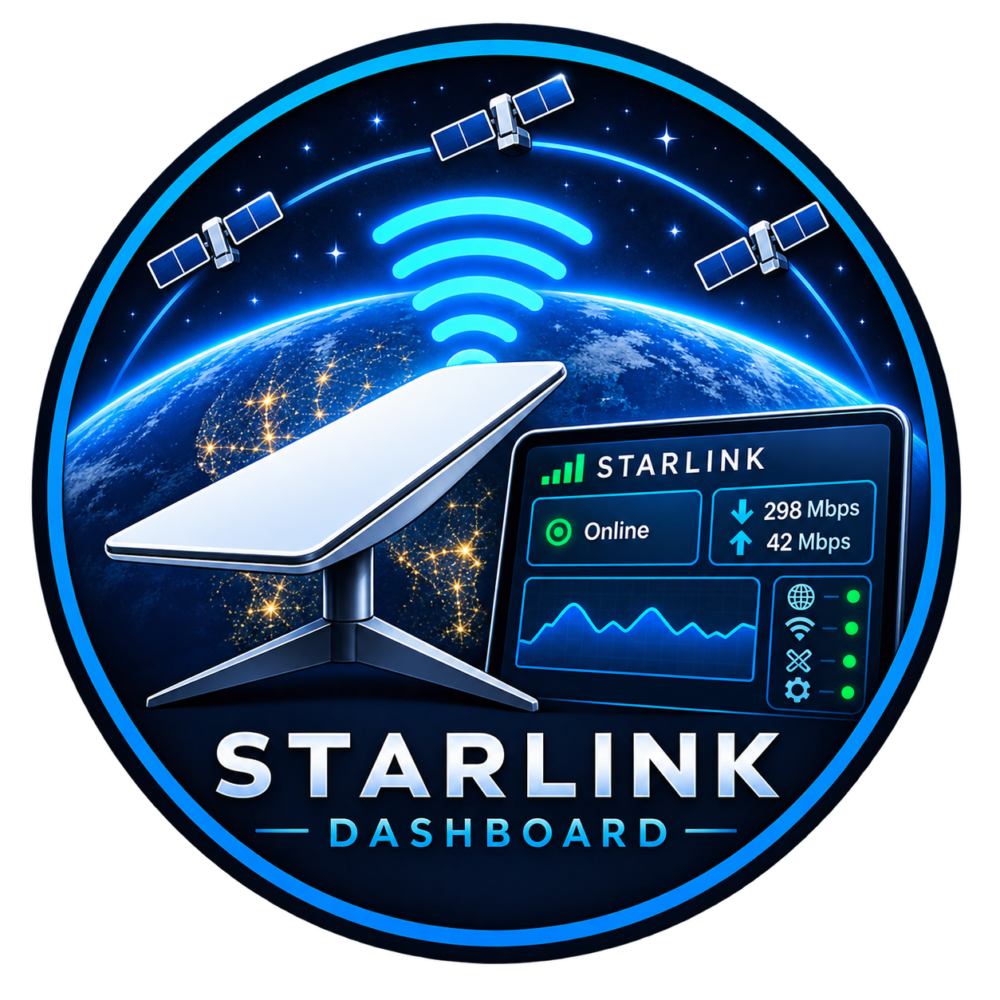

# Starlink Monitor

<div align="center">
  
</div>

A local web dashboard that connects to a Starlink dish via its built-in gRPC
API and displays live telemetry, obstruction maps, connected devices, and alert
history — no cloud account required.

---

## Requirements

| Dependency | Minimum version | Notes |
|---|---|---|
| Python | 3.11+ | `python3 --version` |
| Node.js | 18+ | `node --version` |
| npm | 9+ | bundled with Node |
| Network | — | Must be on the same LAN as the dish |

The dashboard talks to the dish at **`192.168.100.1:9200`** (no authentication
required). You must be connected to the dish's local network — either directly
via Ethernet, or through a router that connects to the dish.

---

## Quick start

### Windows (Standalone .exe — Easiest)

Build a self-contained Windows application with a system tray icon — no Python
or Node installation needed after the build.

```powershell
git clone <this-repo> starlink-dashboard
cd starlink-dashboard
.\build-windows.ps1
```

The build script compiles the frontend, packages everything with PyInstaller,
and copies the result to `Starlink Monitor\` in the repo root. Double-click
`Starlink Monitor\Starlink Monitor.exe` to launch.

The dashboard opens automatically in your browser at `http://localhost:8001`.

> See [WINDOWS_BUILD.md](WINDOWS_BUILD.md) for detailed build instructions,
> `-SkipFrontend` / `-SkipInstaller` flags, and troubleshooting.

### Linux / macOS / Raspberry Pi

```bash
git clone <this-repo> starlink-dashboard
cd starlink-dashboard
chmod +x start.sh
./start.sh
```

Open `http://localhost:5173` in your browser.  
The backend API (Swagger docs) is at `http://localhost:8000/docs`.

### Windows (dev / production mode)

```powershell
git clone <this-repo> starlink-dashboard
cd starlink-dashboard
.\start.ps1
```

Open **http://localhost:5173** in your browser.

> **First-time only — execution policy**  
> If you see "running scripts is disabled", run this once in an elevated
> PowerShell window, then retry:
> ```powershell
> Set-ExecutionPolicy -Scope CurrentUser -ExecutionPolicy RemoteSigned
> ```
> Or bypass it per-invocation:
> ```powershell
> pwsh -ExecutionPolicy Bypass -File .\start.ps1
> ```

---

## Modes

### Development (default)

Runs the FastAPI backend on `:8000` and the Vite dev server on `:5173`.
Hot-module reload is enabled — save any `.jsx` file and the browser updates
instantly.

```bash
# Linux / macOS / Pi
./start.sh

# Windows
.\start.ps1
```

Dependency installs (pip, npm) are skipped automatically when nothing has
changed, so repeat runs start in seconds.

### Production / Raspberry Pi

Builds the React app once, then serves everything from a single FastAPI
process on `:8000`. No Node.js needs to stay running after the build.

```bash
# Linux / macOS / Pi
./start.sh --prod

# Windows
.\start.ps1 -Prod
```

Open **http://localhost:8000**.

#### Auto-start on boot (systemd — Pi)

```ini
# /etc/systemd/system/starlink-monitor.service
[Unit]
Description=Starlink Monitor
After=network-online.target
Wants=network-online.target

[Service]
Type=simple
User=pi
WorkingDirectory=/home/pi/starlink-dashboard
ExecStart=/home/pi/starlink-dashboard/start.sh --prod
Restart=on-failure
RestartSec=10
Environment=DISH_ADDRESS=192.168.100.1:9200
Environment=BACKEND_PORT=8000

[Install]
WantedBy=multi-user.target
```

```bash
sudo systemctl enable --now starlink-monitor
```

---

## Environment variables

| Variable | Default | Description |
|---|---|---|
| `DISH_ADDRESS` | `192.168.100.1:9200` | Dish gRPC endpoint |
| `BACKEND_PORT` | `8000` | FastAPI listen port |
| `FRONTEND_PORT` | `5173` | Vite dev-server port (dev mode only) |
| `SERVE_STATIC` | `0` | Set `1` to serve `frontend/dist/` from FastAPI |

**Windows — setting env vars before launching:**
```powershell
$env:BACKEND_PORT = '8001'; .\start.ps1 -Prod
```

---

## Project structure

```
starlink-dashboard/
├── start.sh                  # Startup script (Linux / macOS / Pi)
├── start.ps1                 # Startup script (Windows PowerShell)
├── build-windows.ps1         # Build .exe (PowerShell)
├── build-windows.bat         # Build .exe (Command Prompt)
├── WINDOWS_BUILD.md          # Windows build guide
├── backend/
│   ├── main.py               # FastAPI app + lifespan
│   ├── requirements.txt
│   ├── tray.py               # Windows system tray entry point
│   ├── starlink-monitor.spec # PyInstaller spec
│   ├── dish/
│   │   ├── telemetry.py      # Background polling (1 s status, 5 s history)
│   │   ├── diagnostics.py    # Obstruction map + pointing
│   │   ├── devices.py        # DHCP clients (Starlink router)
│   │   ├── wifi.py           # WiFi / WAN details (Starlink router)
│   │   ├── alerts.py         # Alert flag parser
│   │   ├── store.py          # SQLite history persistence
│   │   └── client.py         # gRPC channel helper
│   └── routers/
│       ├── health.py         # GET  /api/health
│       ├── status.py         # GET  /api/status
│       ├── history.py        # GET  /api/history
│       ├── diagnostics.py    # GET  /api/diagnostics
│       ├── devices.py        # GET  /api/devices  /api/wan  /api/wifi
│       ├── service.py        # GET  /api/service
│       ├── location.py       # GET  /api/location
│       ├── control.py        # POST /api/control/*
│       ├── speedtest.py      # GET  /api/speedtest/download  POST /api/speedtest/upload
│       └── ws.py             # WS   /ws/live
└── frontend/
    ├── vite.config.js        # Dev proxy: /api/* → :8000
    ├── tailwind.config.js    # Brand colour tokens
    └── src/
        ├── App.jsx           # Shell + LiveContext + routing
        ├── hooks/
        │   ├── useLiveData.js  # WebSocket hook, 900-pt buffer, auto-reconnect
        │   ├── useApi.js       # REST polling hook
        │   ├── useAlertLog.js  # Alert history (localStorage)
        │   └── useSettings.js  # Persistent settings (localStorage)
        ├── components/
        │   ├── Layout/         # Sidebar, Header
        │   ├── Charts/         # ThroughputChart, LatencyChart, PowerChart
        │   ├── ObstructionMap.jsx
        │   ├── TempGauge.jsx
        │   ├── DeviceTable.jsx
        │   ├── WanDetails.jsx
        │   ├── SpeedTest.jsx
        │   └── NoDishPanel.jsx
        └── pages/
            ├── Dashboard.jsx   # Stat cards, charts, obstruction map, WAN details
            ├── Diagnostics.jsx # Full obstruction map, temp gauges, GPS / SNR status
            ├── SkyView.jsx     # Sky view / satellite tracker
            ├── Devices.jsx     # Connected devices table + WAN details
            ├── Alerts.jsx      # Active alerts + persistent history log
            └── Settings.jsx    # Dish address, theme, WiFi info, dish controls
```

---

## API reference

| Method | Path | Description |
|---|---|---|
| GET | `/api/health` | Backend alive + dish reachability |
| GET | `/api/status` | Current dish status snapshot |
| GET | `/api/history?last=900` | Rolling history buffer (max 900 points, 1 s each) |
| GET | `/api/diagnostics` | Obstruction map + pointing |
| GET | `/api/service` | Firmware, hardware version, account service info |
| GET | `/api/location` | GPS coordinates (requires Starlink app auth on some models) |
| GET | `/api/devices` | Connected DHCP clients (requires Starlink router) |
| GET | `/api/wan` | WAN / network details (requires Starlink router) |
| GET | `/api/wifi` | WiFi network info, read-only (requires Starlink router) |
| GET | `/api/speedtest/download` | Run a local download speed test |
| POST | `/api/speedtest/upload` | Run a local upload speed test |
| POST | `/api/control/reboot` | Reboot the dish |
| POST | `/api/control/stow` | Stow the dish |
| POST | `/api/control/unstow` | Unstow the dish |
| POST | `/api/control/gps/enable` | Enable GPS location reporting on the dish |
| POST | `/api/control/gps/disable` | Disable GPS location reporting on the dish |
| POST | `/api/control/restart-backend` | Restart the backend server process |
| WS | `/ws/live` | 1-second telemetry broadcast |

### WebSocket message shape

```json
{
  "timestamp":               1234567890,
  "download_mbps":           187.4,
  "upload_mbps":             23.1,
  "latency_ms":              28.0,
  "drop_rate_pct":           0.4,
  "uptime_s":                86400,
  "state":                   "CONNECTED",
  "is_obstructed":           false,
  "fraction_obstructed_pct": 1.2,
  "snr_above_floor":         true,
  "dish_temp_c":             43.0,
  "board_temp_c":            null,
  "direction_azimuth":       45.2,
  "direction_elevation":     67.8,
  "gps_ready":               true,
  "gps_sats":                8,
  "gps_enabled":             true,
  "software_version":        "...",
  "hardware_version":        "...",
  "alerts":                  []
}
```

`board_temp_c` is `null` on the Starlink Mini (the dish does not report a
separate board temperature).

---

## Dashboard pages

| Page | Route | What it shows |
|---|---|---|
| Dashboard | `/` | Stat cards, throughput / latency / power charts, obstruction map, speed test |
| Diagnostics | `/diagnostics` | Full obstruction map, temperature arc gauges, GPS / SNR status |
| Sky View | `/skyview` | Satellite sky view and tracker |
| Devices | `/devices` | Sortable / filterable connected-device table with OUI-based icons, WAN details |
| Alerts | `/alerts` | Active alert cards + persistent history log (start time, duration, resolved badge) |
| Settings | `/settings` | Dish address + connection test, dark/light theme, WiFi info (read-only), dish controls |

---

## Connected devices and WAN details

Device and WAN data comes from the **Starlink mesh router** (a separate device),
not the dish itself. These sections show "no data" if you:

- Use the dish in bypass mode with your own router, or
- Have a Gen 1 dish without a Starlink router

If you have a Starlink router, it is typically at `192.168.1.1:9000`.
The backend probes this address automatically.

**WiFi settings are read-only.** The Starlink router uses a cryptographic
challenge-response (ECDSA) for all write operations that only the official
Starlink app can authenticate. SSID, password, and band changes must be made
through the Starlink app.

---

## Troubleshooting

**`/api/health` returns `dish_reachable: false`**
- Confirm you're on the Starlink local network (`ping 192.168.100.1`)
- Check that no firewall blocks port 9200

**Charts show no data**
- The dish must be powered on and reachable; the backend polls every 1 s
- Reload the page after a few seconds — the history buffer fills from live data

**"No signal data" on the obstruction map**
- The map endpoint makes a separate gRPC call with a 4 s timeout; if the dish
  is slow to respond, the map returns null and the dashboard shows a placeholder

**Devices / WAN / WiFi panels show no data**

- These require the Starlink mesh router at `192.168.1.1:9000`
- They will be empty if you use the dish in bypass mode or with a third-party router

**Raspberry Pi: `pip install` fails on `grpcio`**
- `grpcio` has arm64 wheels on PyPI for Python 3.11+; ensure you're not on
  a 32-bit Pi OS image
- If needed: `sudo apt install python3-grpcio` before running `start.sh`

**Port already in use**

```bash
# Linux / macOS / Pi
BACKEND_PORT=8001 FRONTEND_PORT=5174 ./start.sh
```

```powershell
# Windows
$env:BACKEND_PORT = '8001'; $env:FRONTEND_PORT = '5174'; .\start.ps1
```

**Windows: "running scripts is disabled"**
```powershell
Set-ExecutionPolicy -Scope CurrentUser -ExecutionPolicy RemoteSigned
```

**Windows: `pip install grpcio` fails**  
Ensure the [Visual C++ Redistributable](https://aka.ms/vs/17/release/vc_redist.x64.exe)
is installed, then retry with:
```powershell
pip install grpcio --only-binary=:all:
```

**Windows .exe: backend window closes immediately**  
Open a terminal, `cd` into the repo root, and run `.\build-windows.ps1` manually
so you can read any error messages before the window closes.
